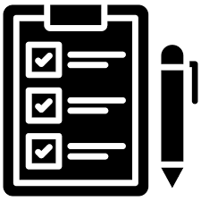

# Приложение To-Do List


## Описание проекта

Это **простое консольное приложение для управлениями задачами** на С#. Программа позволяет *создавать*, **редактировать** и ~~удалять~~ помечать как выполненные, как выполненные, ваши ежедневные задачи.

### Основные функции

- ✔️ **Добавление новых задач**
- 📝 **Просмотр списка задач**
- ✏️ **Редактирование существующих задач**
- ❌ **Удаление задач**
- 📃**Пометка задач как выполненных**
- 📁**Сохранение задач в файл**

### Необходимые условия

Для запуска потребуется:
- **.NET SDk 6.0 или выше**
- **Visual Studio 2022/2019** или **VSC**
- **GIT** (для контроля версий)

---

**Проверка установки .NET:**
```bash
dotnet --version
```

|Ресурс|Документ|Описание|
|----------|--------|--------|
|Документация C#| https://learn.microsoft.com/ru-ru/dotnet/csharp/|Официальная документация|
|Учебник .NET|https://learn.microsoft.com/ru-ru/dotnet/|Бесплатные курсы|
|GitHub проекта|https://github.com/Yalantis/ToDoList|Репозиторий|

---
